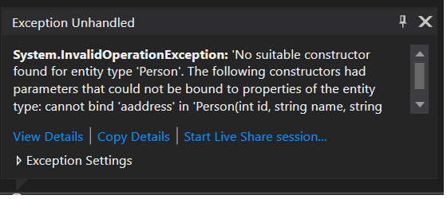

# EFcoreDeletingRows
Example shows that in EF Core 2.2.0 the same instance of DBContext can be manipulated between multiple ```SaveChanges()``` calls.
The same instance can be used within explicit transaction (```BeginTransaction()``` call) or implicit transaction (```dbContext.SaveChanges()``` call does commit operation).   
It did not work well in EF Core 2.0.0.

# Using constructor

[ConstructorUsageByEFCore](./ConstructorUsageByEFCore)

1. OK: If the constructor is not defined in the code and all properties have private set it works correctly.
```
public class Person
{
    public int Id { get; private set; }
    public string Name { get; private set; }
    public string SecondName { get; private set; }
    public string Address { get; private set; }
}
```

2. OK: If we add private constructor still everything is fine. Also we can add breakpoint in the constructor and it is executed.

```
public class Person
{
    public int Id { get; private set; }
    public string Name { get; private set; }
    public string SecondName { get; private set; }
    public string Address { get; private set; }

    private Person()
    {

    }
}
```

3. OK: If we add constructor with params like property names it is executed correctly but we have to set all properties in the constructor.

```
public class Person
{
    public int Id { get; private set; }
    public string Name { get; private set; }
    public string SecondName { get; private set; }
    public string Address { get; private set; }

    private Person(int id, string name, string secondName, string address)
    {
        this.Id = id;
        this.Name = name;
        this.SecondName = secondName;
        this.Address = address;
    }
}
```

4. ERROR: If one of the params does not match to the existing properties then an exception is thrown.

```
public class Person
{
    public int Id { get; private set; }
    public string Name { get; private set; }
    public string SecondName { get; private set; }
    public string Address { get; private set; }

    private Person(int id, string name, string secondName, string aaddress)
    {
        this.Id = id;
        this.Name = name;
        this.SecondName = secondName;
        this.Address = aaddress;
    }
}
```



5. OK: If at least one param is used in a constructor then it has to set this property in the constructor and all other properties are initialized by EFCore by reflection.

```
public class Person
{
    public int Id { get; private set; }
    public string Name { get; private set; }
    public string SecondName { get; private set; }
    public string Address { get; private set; }

    private Person(string name)
    {
        this.Name = name;
    }
}
```    

# InMemoryDB

https://entityframeworkcore.com/providers-inmemory

# UpdateEntityThatHasManyChildren

Make sure to use DB that do not have any EF core migrations becuase if the table with migrations exist then ```Database.EnsureCreated()``` does not work!

[UpdateEntityThatHasManyChildren](./UpdateEntityThatHasManyChildren)

This example shows:

* by default children are not loaded
* if a children data are not loaded we can updated another children data from the parent and update context - not loaded children data will remain without change in db and it seems that it is expected behavior